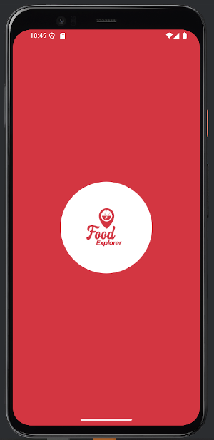
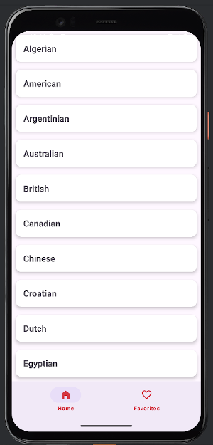
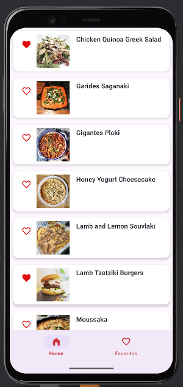
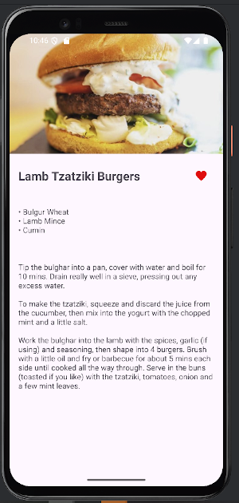
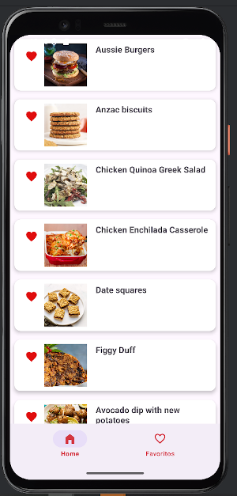

# 🍽️ FoodExplorer

FoodExplorer is an Android application that allows users to explore meals by country, view detailed recipes, and manage their favorite dishes.

The app is built as a **portfolio project** to demonstrate Android development skills using real-world APIs, clean architecture, and modern UI components.

---

## 📱 Features

- 🌍 Browse meals by country
- 📋 View meal details with image and description
- ❤️ Add and remove meals from favorites
- ⭐ Favorites list with persistent storage
- 🧭 Bottom navigation (Home / Favorites)
- 💬 Snackbars for user feedback
- 🎨 Material Design UI
- 🚀 Splash screen on app launch

---

## 🛠️ Tech Stack

- **Language:** Java
- **Architecture:** MVVM
- **Networking:** Retrofit
- **Image Loading:** Glide
- **UI:** XML + Material Components
- **State Management:** ViewModel
- **Persistence:** SharedPreferences
- **API:** TheMealDB

---

## 🧩 Architecture Overview  

The project follows a clean separation of concerns:

```text
MainActivity.java

data/
 ├── api
 │   ├── MealApiService.java
 │   └── RetrofitClient.java
 │
 ├── model
 │   ├── Country.java
 │   ├── CountryResponse.java
 │   ├── FavoriteMeal.java
 │   ├── Meal.java
 │   ├── MealDetail.java
 │   ├── MealDetailResponse.java
 │   └── MealResponse.java
 │
 └── repository
     ├── CountryRepository.java
     ├── MealDetailRepository.java
     └── MealRepository.java

ui/
 ├── countries
 │   ├── CountryAdapter.java
 │   └── CountryViewModel.java
 │
 ├── meals
 │   ├── MealsActivity.java
 │   ├── MealAdapter.java
 │   └── MealViewModel.java
 │
 ├── detail
 │   ├── MealDetailActivity.java
 │   └── MealDetailViewModel.java
 │
 └── favorites
     ├── FavoritesActivity.java
     └── FavoritesAdapter.java

utils/
 └── FavoritesManager.java
 ```


- **UI layer:** Activities + Adapters
- **ViewModel:** Handles UI state and business logic
- **Repository:** Manages data sources and API calls
- **Utils:** Local persistence (favorites)

---

## 📸 Screenshots

### Splash Screen


### Home


### Meals List


### Meal Detail


### Favorites


---

## 🚀 What I Learned

- Working with REST APIs in Android
- Implementing MVVM architecture
- Managing UI state and navigation
- Handling user interactions and feedback
- Persisting data locally
- Improving UX with Material Design components

---

## 🔮 Possible Improvements

- Search meals by name
- Offline support
- Room database for persistence
- Unit testing
- Jetpack Compose UI

---

## 👨‍💻 Author

Developed by **Roberto Abelleira Pesqueira**   
